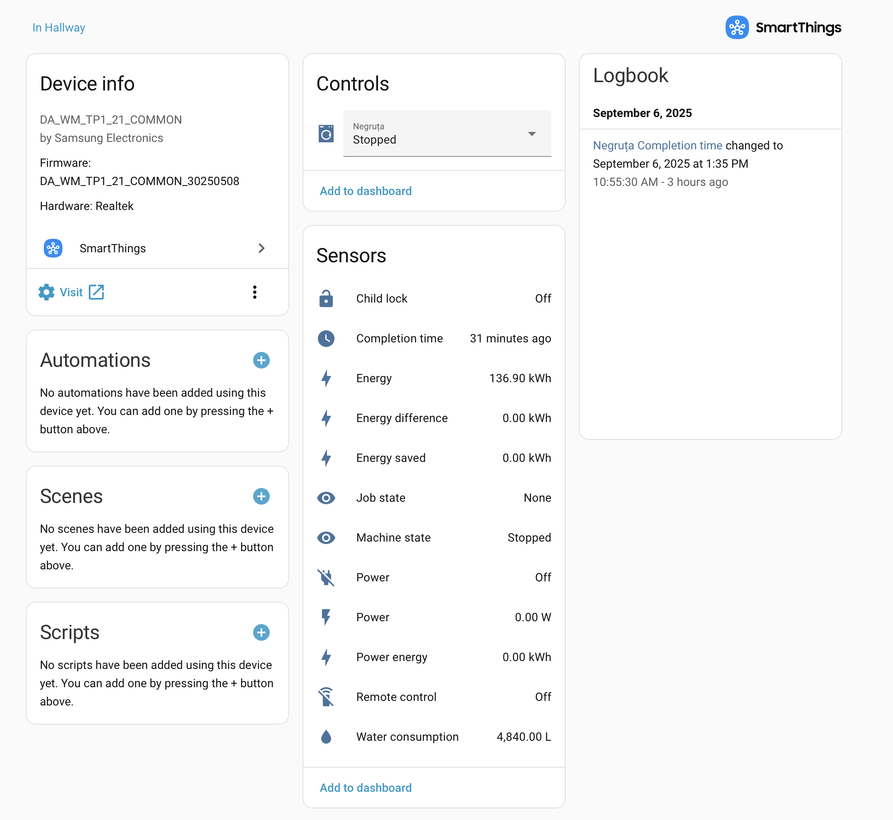
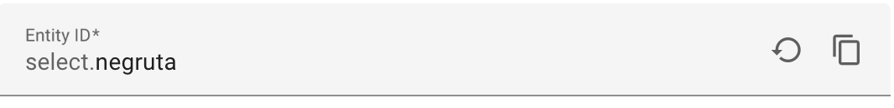
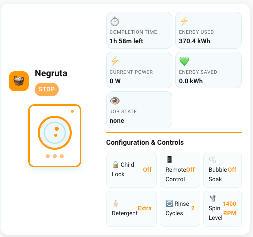
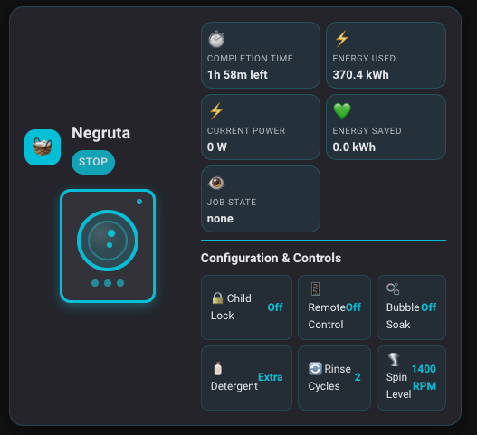

# Samsung Washer & Dryer Card

[](https://github.com/custom-components/hacs)
[](https://github.com/raulpetruta/samsung-ha-washer-card)

A beautiful, animated Home Assistant card for Samsung washing machines and dryers with SmartThings integration.

## Features

🎨 **Modern Design**
- Beautiful appliance-inspired color scheme
- Automatic light/dark mode support
- Smooth animations and hover effects

🔄 **Animated Appliances**
- Animated washing machine with spinning drum and water effects
- Animated dryer with tumbling action and heat indicator
- Color-coded status lights (Aqua/Green/Amber for washers, Orange for dryers)

🏠 **Dual Device Support**
- Samsung washing machines with SmartThings integration
- Samsung dryers with SmartThings integration
- Easy switching between device types via configuration

📊 **Rich Information Display**
- Energy consumption and water usage
- Completion time with smart formatting
- All sensor data in organized grid layout
- Configuration and control status

⚙️ **Highly Configurable**
- Custom device names
- Configurable icons (emoji or MDI)
- Adjustable completion status duration

## Installation

### HACS (Recommended)

1. Open HACS in your Home Assistant
2. Go to "Frontend" section
3. Click "Explore & Download Repositories"
4. Search for "Samsung Washer Card"
5. Download and install
6. Restart Home Assistant

### Manual Installation

1. Download `samsung-washer-card.js` from the [latest release](https://github.com/raulpetruta/samsung-ha-washer-card)
2. Copy to `/config/www/samsung-washer-card/samsung-washer-card.js`
3. Add to your Lovelace resources:

```yaml
resources:
  - url: /local/samsung-washer-card/samsung-washer-card.js
    type: module
```

## Configuration

### Visual Editor (Recommended)

The card now includes a visual configuration editor! Simply:

1. Add the card to your dashboard
2. Click "Configure" or the edit button
3. Use the visual interface to set all options including:
   - Device name and icon
   - Grid layout options for full width control
   - Status display duration

### Get the device_name

Under Controls, click on the first option


Your device_name will be "X" (what's after the "select.")


### Manual Configuration

#### Basic Configuration

**For Washing Machine:**
```yaml
type: custom:samsung-washer-card
device_name: washing_machine  # Replace with your device name
dryer: false  # Set to true for dryers
```

**For Dryer:**
```yaml
type: custom:samsung-washer-card
device_name: dryer  # Replace with your device name
dryer: true  # Set to true for dryers
```

#### Full Configuration

```yaml
type: custom:samsung-washer-card
device_name: washing_machine  # or "dryer" for dryers
dryer: false  # Set to true for dryers
icon: "mdi:washing-machine"  # Custom icon (emoji or MDI)
complete_status_for_x_hours: 2  # Hours to show "completed" status
```

## Configuration Options

| Option | Type | Default | Description |
|--------|------|---------|-------------|
| `device_name` | string | **Required** | Name of your Samsung washer/dryer device |
| `dryer` | boolean | `false` | Set to `true` for dryers, `false` for washers |
| `icon` | string | `🧺` (washer) / `🌪️` (dryer) | Icon for the card header (emoji or `mdi:icon-name`) |
| `complete_status_for_x_hours` | number | `2` | Hours to show green "completed" status light |

## Supported Entities

The card automatically detects different entity types based on device mode:

### For Washing Machines (`dryer: false`)

**Sensors:**

- `sensor.{device_name}_machine_state`
- `sensor.{device_name}_job_state`
- `sensor.{device_name}_completion_time`
- `sensor.{device_name}_energy`
- `sensor.{device_name}_energy_saved`
- `sensor.{device_name}_power`
- `sensor.{device_name}_water_consumption`

**Binary Sensors:**

- `binary_sensor.{device_name}_child_lock`
- `binary_sensor.{device_name}_remote_control`
- `binary_sensor.{device_name}_power`

**Controls:**

- `switch.{device_name}_bubble_soak`
- `select.{device_name}_detergent_dispense_amount`
- `select.{device_name}_spin_level`
- `number.{device_name}_rinse_cycles`

### For Dryers (`dryer: true`)

**Sensors:**

- `sensor.{device_name}_machine_state`
- `sensor.{device_name}_job_state`
- `sensor.{device_name}_completion_time`
- `sensor.{device_name}_energy` (optional)
- `sensor.{device_name}_energy_saved` (optional)
- `sensor.{device_name}_power` (optional)

**Binary Sensors:**

- `binary_sensor.{device_name}_power`
- `binary_sensor.{device_name}_remote_control`

**Controls:**

- `select.{device_name}` (dryer program selector)

> **Note:** Dryers automatically hide water consumption and washer-specific controls like bubble soak, detergent settings, etc.

## Examples

### Washing Machine with Custom Icon

```yaml
type: custom:samsung-washer-card
device_name: washing_machine
dryer: false
icon: "mdi:washing-machine"
```

### Dryer Configuration

```yaml
type: custom:samsung-washer-card
device_name: dryer
dryer: true
icon: "mdi:tumble-dryer"
```

### Multiple Appliances

```yaml
# Kitchen Washer
type: custom:samsung-washer-card
device_name: washing_machine
dryer: false
icon: "🏠"

# Laundry Room Dryer  
type: custom:samsung-washer-card
device_name: dryer
dryer: true
icon: "🌪️"
```

## Screenshots

### Light Mode


### Dark Mode


## Development

The project has a clean, modular structure:

```text
src/
├── main.js              # Main card class
├── components/          # UI components
├── styles/              # CSS styles
└── utils/               # Helper utilities
```

### Building for Distribution

```bash
npm run build    # Creates samsung-washer-card.js for HACS
npm run dev      # Development build
npm run clean    # Clean build files
```

## Contributing

Contributions are welcome! Please feel free to submit a Pull Request.

## License

This project is licensed under the MIT License - see the [LICENSE](LICENSE) file for details.

## Support

If you find this card useful, consider:

- ⭐ Starring this repository
- 🐛 Reporting issues
- 💡 Suggesting new features
- ☕ [Buying me a coffee](https://buymeacoffee.com/raulpetruta)
