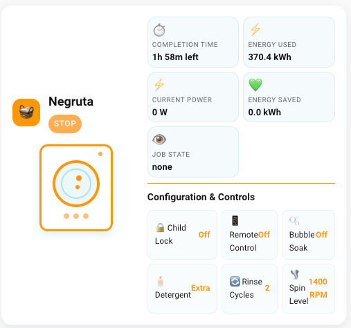
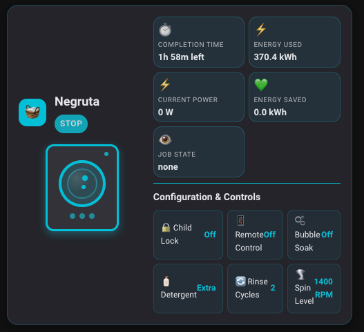
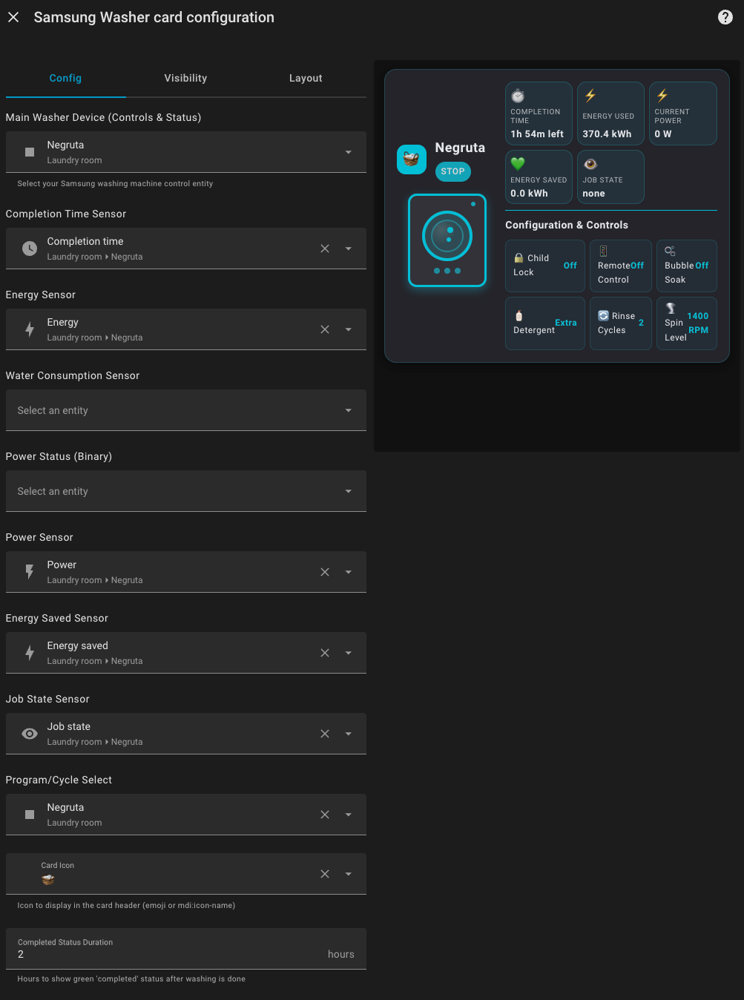

# Samsung Washer Card

[](https://github.com/custom-components/hacs)
[](https://github.com/raulpetruta/samsung-ha-washer-card)

A beautiful, animated Home Assistant card for Samsung washing machines. It reads entities from Home Assistant and does not call Samsung's cloud API.

Use [LocalThings](https://github.com/mbillow/localthings) to connect the washer on your local network. Existing dashboards that still use the old SmartThings entity names keep working.

## Connect the washer

1. Install [LocalThings](https://github.com/mbillow/localthings) from HACS (Integrations). It is in the default list.
2. Restart Home Assistant, then go to **Settings > Devices & Services > Add Integration > LocalThings**.
3. Enter the washer's IP address. LocalThings adds one device and its sensors and controls.
4. Add this card and pick any entity from that washer. The card finds the rest on the same device.

## Features

🎨 **Modern Design**
- Beautiful appliance-inspired color scheme
- Automatic light/dark mode support
- Smooth animations and hover effects

🔄 **Animated Washing Machine**
- Color-coded status light (Aqua/Green/Amber)

📊 **Rich Information Display**
- Energy consumption and water usage
- Completion time with smart formatting
- All sensor data in organized grid layout
- Configuration and control status

⚙️ **Highly Configurable**
- Custom device names
- Configurable icons (emoji or MDI)
- Adjustable completion status duration

## Installation

### HACS (Recommended)

1. Open HACS in your Home Assistant
2. Go to the 3 dots on top right
3. Click "Custom repositories"
4. For "Repository", add "https://github.com/raulpetruta/samsung-ha-washer-card"
5. For "Type", choose "Dashboard"
6. Click "Add"
7. Search for "Samsung Washer Card"
8. Click the Download button and install it
9. After the installation is done, click "Reload" as prompted

### Manual Installation

1. Download `samsung-ha-washer-card.js` from the [latest release](https://github.com/raulpetruta/samsung-ha-washer-card)
2. Copy to `/config/www/samsung-washer-card/samsung-ha-washer-card.js`
3. Add to your Lovelace resources:

```yaml
resources:
  - url: /local/samsung-washer-card/samsung-ha-washer-card.js
    type: module
```

## Configuration

### Visual Editor (Recommended)

1. Add the card to your dashboard
2. Click "Configure" or the edit button
3. Pick any entity that belongs to the washer
4. Set the icon and how long the completed light stays on

LocalThings entities on that same device are filled in automatically. You can still override individual sensors if you want a different one, or leave a sensor empty to hide it.

### Manual Configuration

#### LocalThings

`device_name` is the full entity id of any entity on the washer:

```yaml
type: custom:samsung-washer-card
device_name: sensor.washer_machine_state
icon: "mdi:washing-machine"
complete_status_for_x_hours: 2
```

#### Legacy SmartThings names

Older setups can still pass the shared object-id prefix:

```yaml
type: custom:samsung-washer-card
device_name: washing_machine
icon: "mdi:washing-machine"
complete_status_for_x_hours: 2
```

## Configuration Options

| Option | Type | Default | Description |
|--------|------|---------|-------------|
| `device_name` | string | **Required** | Any washer entity id, or a legacy device prefix |
| `icon` | string | `🧺` | Icon for the card header (emoji or `mdi:icon-name`) |
| `complete_status_for_x_hours` | number | `2` | Hours to show the green completed light after the cycle ends |
| `program_entity` | string | auto | Cycle select. Overrides automatic detection |
| `completion_time_entity` | string | auto | Finish-time sensor |
| `energy_entity` | string | auto | Energy sensor |
| `energy_saved_entity` | string | auto | Energy-saved sensor |
| `water_entity` | string | auto | Water-use sensor |
| `power_entity` | string | auto | Current power sensor |
| `power_binary_entity` | string | auto | Power on/off sensor |
| `job_state_entity` | string | auto | Cycle stage sensor |

## What the card shows

From a LocalThings washer, the card matches these translation keys on the selected device:

- Machine state, progress, and cycle (`machine_state`, `progress`, `washer_cycle`)
- Finish time (`finish_time`)
- Energy, power, and water (`energy_kwh`, `energy_saved_kwh`, `power_watts`, `water_liters`, `power_switch`)
- Child lock, remote control, bubble soak, detergent dose, rinse count, and spin speed

Child lock uses Home Assistant's lock polarity: `on` means unlocked. Spin values get an `RPM` suffix only when they are numeric. Sensor units come from the entity.

### Legacy entity ids

If the card cannot see a device registry entry, it still looks up the old SmartThings object ids.

#### Sensors
- `sensor.{device_name}_machine_state`
- `sensor.{device_name}_job_state`
- `sensor.{device_name}_completion_time`
- `sensor.{device_name}_energy`
- `sensor.{device_name}_energy_saved`
- `sensor.{device_name}_power`
- `sensor.{device_name}_water_consumption`

#### Binary Sensors
- `binary_sensor.{device_name}_child_lock`
- `binary_sensor.{device_name}_remote_control`
- `binary_sensor.{device_name}_power`

#### Controls
- `switch.{device_name}_bubble_soak`
- `select.{device_name}_detergent_dispense_amount`
- `select.{device_name}_spin_level`
- `number.{device_name}_rinse_cycles`

## Examples

### With Custom Icon

```yaml
type: custom:samsung-washer-card
device_name: sensor.washer_machine_state
icon: "mdi:washing-machine"
```

### Multiple Washers

```yaml
# Upstairs
type: custom:samsung-washer-card
device_name: sensor.upstairs_washer_machine_state
icon: "🏠"

# Downstairs
type: custom:samsung-washer-card
device_name: sensor.downstairs_washer_machine_state
icon: "🧺"
```

## Screenshots

### Light Mode


### Dark Mode


### Setup Card View


You can now customize which information cards appear in the grid:
- **Manual Selection**: Choose the exact entity for each sensor (Energy, Water, Power, etc.) from the dropdown menus.
- **Hide Unused**: Leave a field empty if you don't want to show that specific card. The grid will automatically adjust to hide unconfigured sensors.

## Development

The project has a clean, modular structure:

```text
src/
├── main.js              # Main card class
├── components/          # UI components
├── styles/              # CSS styles
└── utils/               # Helper utilities
```

### Building for Distribution

```bash
npm run build    # Creates samsung-ha-washer-card.js for HACS
npm run dev      # Development build
npm run clean    # Clean build files
```

## Contributing

Contributions are welcome! Please feel free to submit a Pull Request.

## License

This project is licensed under the MIT License - see the [LICENSE](LICENSE) file for details.

## Support

If you find this card useful, consider:

- ⭐ Starring this repository
- 🐛 Reporting issues
- 💡 Suggesting new features
- ☕ [Buying me a coffee](https://buymeacoffee.com/raulpetruta)
