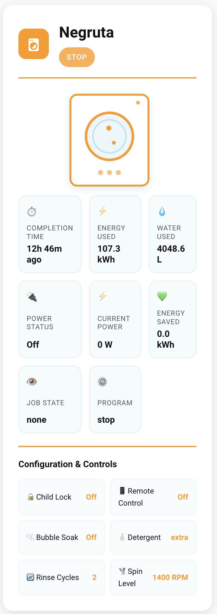
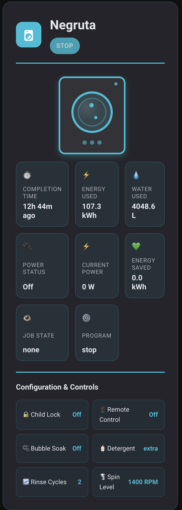

# Samsung Washer Card

[](https://github.com/custom-components/hacs)
[](https://github.com/raulpetruta/samsung-washer-card)

A beautiful, animated Home Assistant card for Samsung washing machines with SmartThings integration.

## Features

🎨 **Modern Design**
- Beautiful appliance-inspired color scheme
- Automatic light/dark mode support
- Smooth animations and hover effects

🔄 **Animated Washing Machine**
- Real-time spinning drum animation when running
- Animated water level with bubbling effect
- Color-coded status light (Aqua/Green/Amber)

📊 **Rich Information Display**
- Energy consumption and water usage
- Completion time with smart formatting
- All sensor data in organized grid layout
- Configuration and control status

⚙️ **Highly Configurable**
- Custom device names
- Configurable icons (emoji or MDI)
- Adjustable completion status duration
- Responsive design for all screen sizes

## Installation

### HACS (Recommended)

1. Open HACS in your Home Assistant
2. Go to "Frontend" section
3. Click "Explore & Download Repositories"
4. Search for "Samsung Washer Card"
5. Download and install
6. Restart Home Assistant

### Manual Installation

1. Download `samsung-washer-card.js` from the [latest release](https://github.com/yourusername/samsung-washer-card/releases)
2. Copy to `/config/www/samsung-washer-card/samsung-washer-card.js`
3. Add to your Lovelace resources:

```yaml
resources:
  - url: /local/samsung-washer-card/samsung-washer-card.js
    type: module
```

## Configuration

### Get the device_name

Under Controls, click on the first option


Your device_name will be setup.X


### Basic Configuration

```yaml
type: custom:samsung-washer-card
device_name: washing_machine  # Replace with your device name
```

### Full Configuration

```yaml
type: custom:samsung-washer-card
device_name: washing_machine
icon: "mdi:washing-machine"  # Custom icon (emoji or MDI)
complete_status_for_x_hours: 2  # Hours to show "completed" status
```

## Configuration Options

| Option | Type | Default | Description |
|--------|------|---------|-------------|
| `device_name` | string | **Required** | Name of your Samsung washer device |
| `icon` | string | `🧺` | Icon for the card header (emoji or `mdi:icon-name`) |
| `complete_status_for_x_hours` | number | `2` | Hours to show green "completed" status light |

## Supported Entities

The card automatically detects these entity types for your device:

### Sensors
- `sensor.{device_name}_machine_state`
- `sensor.{device_name}_job_state`
- `sensor.{device_name}_completion_time`
- `sensor.{device_name}_energy`
- `sensor.{device_name}_energy_saved`
- `sensor.{device_name}_power`
- `sensor.{device_name}_water_consumption`

### Binary Sensors
- `binary_sensor.{device_name}_child_lock`
- `binary_sensor.{device_name}_remote_control`
- `binary_sensor.{device_name}_power`

### Controls
- `switch.{device_name}_bubble_soak`
- `select.{device_name}_detergent_dispense_amount`
- `select.{device_name}_spin_level`
- `number.{device_name}_rinse_cycles`

## Examples

### With Custom Icon

```yaml
type: custom:samsung-washer-card
device_name: washing_machine
icon: "mdi:washing-machine"
```

### Multiple Washers

```yaml
# Kitchen Washer
type: custom:samsung-washer-card
device_name: kitchen_washer
icon: "🏠"

# Laundry Room Washer  
type: custom:samsung-washer-card
device_name: main_washer
icon: "mdi:tumble-dryer"
```

## Screenshots

### Light Mode


### Dark Mode


## Development

The project has a clean, modular structure:

```text
src/
├── main.js              # Main card class
├── components/          # UI components
├── styles/              # CSS styles
└── utils/               # Helper utilities
```

### Building for Distribution

```bash
npm run build    # Creates samsung-washer-card.js for HACS
npm run dev      # Development build
npm run clean    # Clean build files
```

## Contributing

Contributions are welcome! Please feel free to submit a Pull Request.

## License

This project is licensed under the MIT License - see the [LICENSE](LICENSE) file for details.

## Support

If you find this card useful, consider:

- ⭐ Starring this repository
- 🐛 Reporting issues
- 💡 Suggesting new features
- ☕ [Buying me a coffee](https://buymeacoffee.com/raulpetruta)
